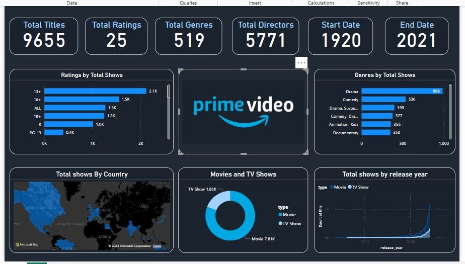

# Amazon Prime Video – Content Analysis Dashboard

> *Exploring 9,600+ titles across movies and TV shows to uncover streaming trends on Amazon Prime Video.*


---

## Overview

This project analyzes the **Amazon Prime Video content library** using a real-world dataset of 9,668 titles. The goal is to uncover trends in content type, genres, ratings, countries, and release history - all visualized through an interactive **Power BI dashboard**.

The project covers the complete analytics workflow - from raw CSV exploration and data cleaning to building a professional BI dashboard.

---

## Dataset

**File:** `amazon_prime_titles.csv`  
**Source:** Amazon Prime Video titles catalogue  
**Total Records:** 9,668 titles  

| Column | Description |
|---|---|
| `show_id` | Unique identifier for each title |
| `type` | Movie or TV Show |
| `title` | Name of the content |
| `director` | Director(s) of the title |
| `cast` | Main cast members |
| `country` | Country of production |
| `date_added` | Date added to Prime Video |
| `release_year` | Original release year (1920–2021) |
| `rating` | Content rating (13+, 16+, 18+, ALL, R, etc.) |
| `duration` | Runtime (minutes for movies, seasons for shows) |
| `listed_in` | Genre(s) |
| `description` | Short synopsis |

### Dataset Snapshot

| Metric | Value |
|---|---|
| Total Titles | 9,655 |
| Movies | 7,814 |
| TV Shows | 1,854 |
| Unique Ratings | 25 |
| Unique Genres | 519 |
| Total Directors | 5,771 |
| Content Span | 1920 – 2021 |
| Top Countries | United States, India, United Kingdom |

---

## Tools & Technologies

| Tool | Purpose |
|---|---|
| **Power BI Desktop** | Interactive dashboard & visualizations |
| **Python (Pandas)** | Data exploration & cleaning |
| **CSV** | Raw data source |
| **GitHub** | Version control & project sharing |

---

## Project Workflow

```
Raw CSV  →  Data Exploration  →  Data Cleaning  →  Power BI Dashboard  →  Insights
```

### 1. Data Loading
- Loaded `amazon_prime_titles.csv` using Python (Pandas)
- Inspected shape, column types, and null values
- Identified key fields for analysis

### 2. Data Exploration
- Analyzed distribution of Movies vs. TV Shows
- Explored genre frequency, rating breakdowns, and release year trends
- Identified top content-producing countries

### 3. Data Cleaning
- Handled missing values in `director`, `cast`, `country`, `date_added`, and `rating`
- Standardized column datatypes
- Removed inconsistencies and prepared data for Power BI import

### 4. Dashboard Development

Built a dark-themed, professional Power BI dashboard with:

- KPI Cards — Total Titles, Ratings, Genres, Directors, Date Range
- Ratings by Total Shows — Horizontal bar chart
- Genres by Total Shows — Top genres ranked
- Movies vs. TV Shows — Donut chart split
- Total Shows by Country — Interactive world map
- Total Shows by Release Year — Timeline trend line chart

---

## Dashboard Preview



> **Key KPIs:** 9,655 Titles · 25 Ratings · 519 Genres · 5,771 Directors · Content from 1920–2021  
> **Visuals:** Ratings breakdown · Genre ranking · Movies vs TV Shows donut · Country world map · Release year trend

---

## Key Insights

- **Movies dominate** the platform — 7.81K movies vs. 1.85K TV shows
- **Drama** is the most popular genre with 986 titles, followed by Comedy (536)
- **13+ is the most common rating** with 2,117 titles, indicating a largely teen-friendly library
- **United States & India** are the top content-producing countries on the platform
- **Content additions surged post-2000**, peaking sharply around 2019–2021
- **519 unique genres** show the platform's wide variety of content categories

---

## How to Run the Project

### Step 1: Clone the Repository

```bash
git clone https://github.com/your-username/amazon-prime-analysis.git
cd amazon-prime-analysis
```

### Step 2: Explore the Dataset (Optional – Python)

```bash
pip install pandas
python3 -c "import pandas as pd; df = pd.read_csv('data/amazon_prime_titles.csv'); print(df.describe())"
```

### Step 3: Open the Power BI Dashboard

1. Open **Power BI Desktop**
2. Load `Amazon_Prime_dashboard.pbix` from the `/dashboard` folder
3. Refresh the data source if prompted

---

## Project Structure

```
amazon-prime-analysis/
│
├── data/
│   └── amazon_prime_titles.csv       # Raw dataset (9,668 rows)
│
├── dashboard/
│   └── Amazon_Prime_dashboard.pbix   # Power BI dashboard file
│
├── images/
│   └── Prime_Video_dashboard.jpg     # Dashboard screenshot
│
└── README.md
```

---

## Conclusion

This project demonstrates how raw streaming catalogue data can be transformed into compelling visual insights using **Power BI**. It highlights content strategy patterns on Amazon Prime Video - from genre preferences and audience ratings to global content distribution and historical growth trends spanning over 100 years of cinema.

---
